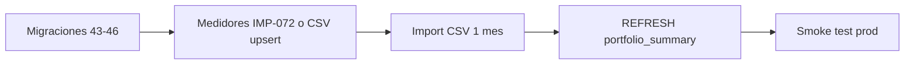

# PASA lecturas — prod (2.17)

Estado **2026-06-07:** prod ya tiene 875 medidores y ~2.6M lecturas (ene 2026) bajo tenant `pasa` (`c3b8d5e6-2222-4000-a000-000000000002`). Migr. `43–46` aplicadas.

Esta guía aplica para **re-import** o entornos nuevos.

## Prerrequisitos

1. Migraciones vía ECS Exec: `./scripts/apply-prod-migrations-2.17.sh` ([runbook](rds-migrations-via-ecs-exec.md))
2. Backend **2.17.x** en `monitoreo-v2-backend-restored`
3. CSVs accesibles desde tarea ECS (5 archivos, ~2.5M filas ene 2026)

| Archivo | Encoding |
|---------|----------|
| `MALL_GRANDE_446_completo.csv` | latin1 |
| `MALL_MEDIANO_254_completo.csv` | latin1 |
| `OUTLET_70_anual.csv` | utf8 |
| `SC52_StripCenter_anual.csv` | utf8 |
| `SC53_StripCenter_anual.csv` | utf8 |

Drive fuente: [carpeta PASA](https://drive.google.com/drive/folders/1VwbEPmoB1fXvhJTDMaP_6m3bBMYLi0-V).

## Orden recomendado



### 1. Tenant PASA (`45-pasa-client-tenant`)

Crea tenant `pasa` (`b0000002-0000-0000-0000-000000000001`) y reasigna edificios desde Globe Power si aplica.

Verificar:

```sql
SELECT id, slug FROM tenants WHERE slug = 'pasa';
SELECT COUNT(*) FROM buildings WHERE tenant_id = 'b0000002-0000-0000-0000-000000000001';
```

### 2. Medidores

- **Opción A (UI):** Admin → Medidores → Importar (IMP-072) con CSV/XLSX de catálogo.
- **Opción B (script):** El import de lecturas hace upsert de medidores desde filas CSV (`meter-catalog.mjs`).

Esperado: **875 medidores** activos tenant PASA.

### 3. Import lecturas (1 mes)

**Local (validado):**

```bash
cd monitoreo-v2/scripts/pasa-readings
CSV_DIR=../../../docs ./import-one-month.sh
```

**Prod:** ejecutar el mismo script desde una sesión con acceso RDS (ECS Exec one-off o Fargate task en VPC):

```bash
export DB_HOST=monitoreo-v2-db.ci1q4okokkkd.us-east-1.rds.amazonaws.com
export DB_PORT=5432
export DB_NAME=monitoreo_v2
export DB_USERNAME=emadmin
export DB_PASSWORD='<from Secrets Manager>'
export FROM_DATE=2026-01-01T00:00:00.000Z
export TO_DATE=2026-01-31T23:59:59.999Z
export CSV_DIR=/tmp/pasa-csv

cd /app/scripts/pasa-readings   # o copiar carpeta a la tarea
./import-one-month.sh
```

Variables clave:

| Variable | Valor prod |
|----------|------------|
| `PASA_TENANT_ID` | Local seed: `b0000002-0000-0000-0000-000000000001`. **Prod RDS:** `c3b8d5e6-2222-4000-a000-000000000002` (mismo slug `pasa`; migración `45` no reemplaza tenant existente). |
| `FROM_DATE` / `TO_DATE` | Ventana 1 mes (default ene 2026) |
| `BATCH_SIZE` | `2000` (ajustar si timeout) |

Idempotencia: `ON CONFLICT (meter_id, timestamp, source)` — re-ejecutar es seguro.

### 4. Refresh agregados

`import-one-month.sh` llama `refreshAggregates` al final (CAGG + `portfolio_summary`).

Manual vía ECS Exec:

```sql
REFRESH MATERIALIZED VIEW portfolio_summary;
```

### 5. Verificación

```sql
SELECT COUNT(*) FROM meters WHERE tenant_id = 'b0000002-0000-0000-0000-000000000001';
SELECT COUNT(*) FROM readings WHERE tenant_id = 'b0000002-0000-0000-0000-000000000001';
SELECT COUNT(*) FROM portfolio_summary;
SELECT source, COUNT(*) FROM readings GROUP BY source ORDER BY COUNT DESC;
```

Smoke HTTP (desde laptop contra prod API):

```bash
cd monitoreo-v2/backend
API_BASE=https://plataforma.globepower.cl/api \
TENANT_ID=b0000002-0000-0000-0000-000000000001 \
npm run test:smoke-dashboard
```

## Timescale pendiente (Anexo 07)

Migraciones **`22-retention-5y`** y **`23-cagg-15min`** requieren extensión TimescaleDB en RDS prod. Aplicar cuando esté habilitada:

```bash
./scripts/apply-prod-migrations-2.17.sh 22-retention-5y 23-cagg-15min
```

## SSO Azure AD PASA

Tras datos en prod:

1. Admin → Configuración empresa → SSO: issuer, client ID, tenant ID Azure AD.
2. Validar login `/login?tenant=pasa` end-to-end.
3. SCIM webhook secret opcional (off-boarding).

## Referencias

- Script local: `monitoreo-v2/scripts/pasa-readings/`
- Pipeline: [`docs/context/ingest-pipeline.md`](../context/ingest-pipeline.md)
- Migraciones ECS: [`rds-migrations-via-ecs-exec.md`](rds-migrations-via-ecs-exec.md)
