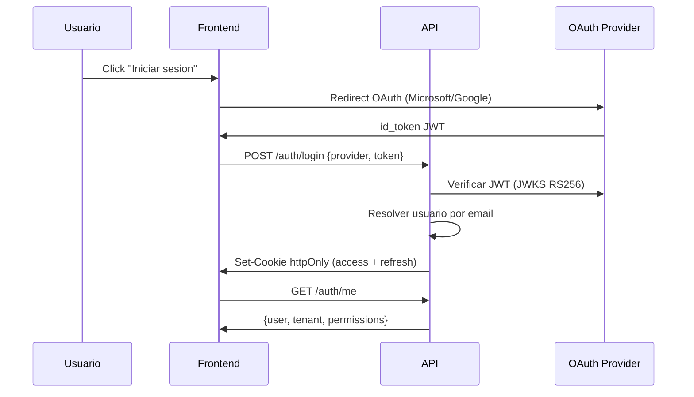

## Flujo de autenticacion

Energy Monitor soporta dos proveedores OAuth:

- **Microsoft** (MSAL redirect)
- **Google** (credential/One Tap)



## Login

```bash
POST /auth/login
Content-Type: application/json

{
  "provider": "google",    // "google" | "microsoft"
  "token": "<id_token>"   // JWT del proveedor OAuth
}
```

La respuesta setea dos cookies httpOnly:
- `access_token` -- JWT de sesion (15 min en prod)
- `refresh_token` -- token de rotacion (24h)

:::warning
En produccion las cookies usan prefijo `__Host-` (requieren HTTPS + same-origin).
No intentes leer estas cookies desde JavaScript.
:::

## Refresh

```bash
POST /auth/refresh
# Cookie refresh_token se envia automaticamente
# Respuesta: nuevas cookies access + refresh (rotacion)
```

## Logout

```bash
POST /auth/logout
# Limpia cookies y revoca refresh token
```

## Verificar sesion

```bash
GET /auth/me
# Respuesta: usuario, tenant, permisos
```

```json title="Respuesta"
{
  "user": {
    "id": "uuid",
    "email": "user@company.com",
    "displayName": "Juan Perez",
    "isActive": true
  },
  "tenant": {
    "id": "uuid",
    "name": "PASA",
    "slug": "pasa"
  },
  "permissions": ["buildings:read", "meters:read", "alerts:read"]
}
```

## MFA

Si el rol del usuario requiere MFA (`require_mfa: true`), despues del primer login OAuth
se muestra un codigo QR para configurar TOTP. Las sesiones posteriores requieren
el codigo de 6 digitos del authenticator.
